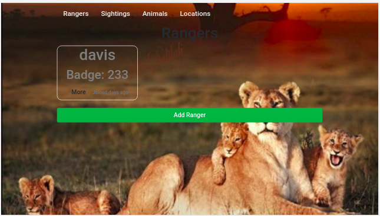
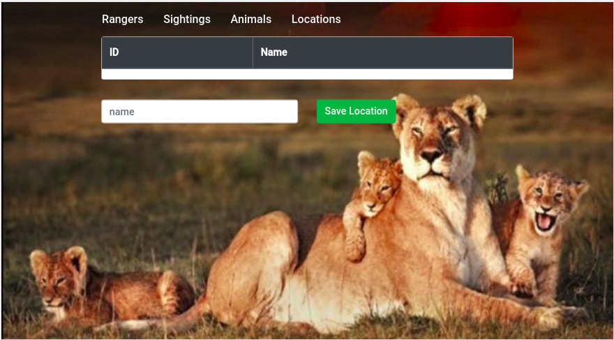
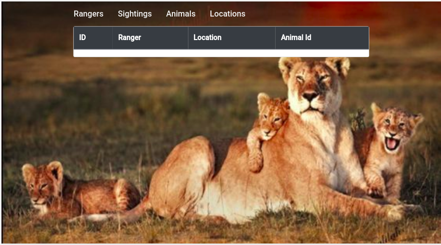

# Wildlife Tracker
## By Davis
A java spark app for the Forest Service to conduct an environmental impact study.

## Technologies and frameworks used
    1. java 12 /11
    2. spark core 2.12
    4. Spark Handlebars
    5. Junit 5
    6. Postgres database

## Database

    CREATE TABLE animals(id SERIAL PRIMARY KEY,health varchar, age varchar, type varchar,name varchar);
    CREATE TABLE locations(id SERIAL PRIMARY KEY, name varchar);
    CREATE TABLE rangers(id SERIAL PRIMARY KEY, firstname varchar, lastname varchar , badgenumber int);
    CREATE TABLE sightings(id SERIAL PRIMARY KEY, ranger varchar , location varchar, animalid int);
    
## Testing

   ```java
   $: gradle test
```

## ScreenShots





## Let us collaborate
  Email: davisdavy96@gmail.com
  


## License
[](LICENSE)